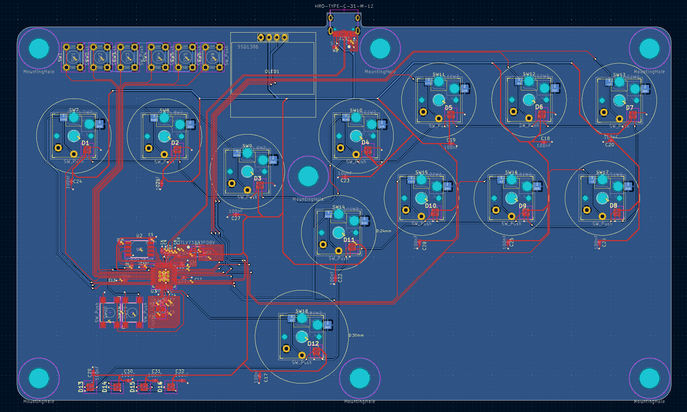
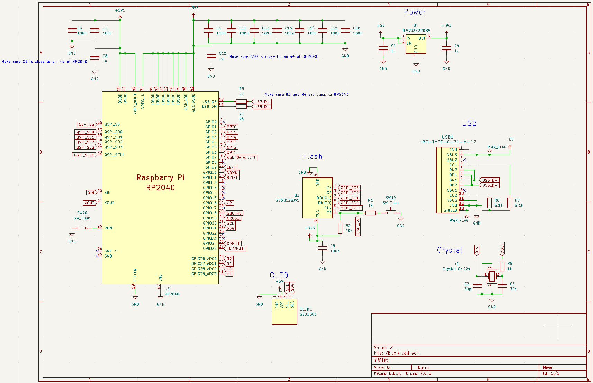
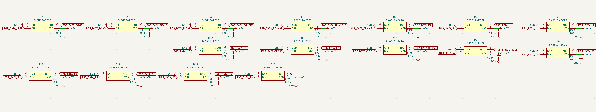
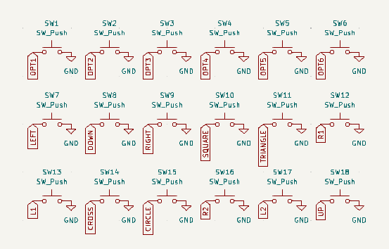

# VBox: Low profile hitbox-layout fightstick

This repository is a fork of jfedor2's Flatbox repository. Their original files are located in this repo [here](jfedor2_files).
You can also check our their repository [here](https://github.com/jfedor2/flatbox)

## PCB Image:

## Schematic Images:

